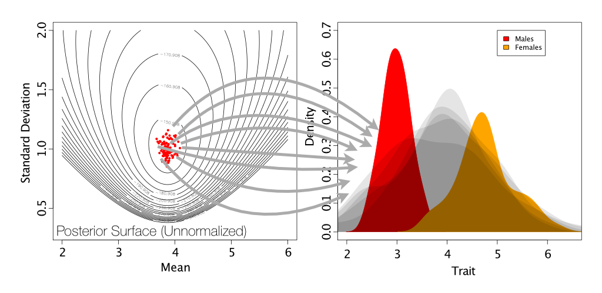
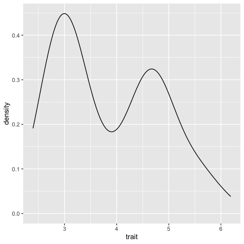

```{r setup, include=FALSE}
knitr::opts_chunk$set(echo = TRUE)
```

## Simulations

- On Tuesday, we learned about rules on how to design a simulation study. Today, we are doing an actual simulation as an example. 

- First download the data set called Birds.csv that is under simulations in Moodle and upload it to the Rstudio Cloud. 

- Our goal is to assess the fit between a data that is generated from a model and the actual data collected from the field. 

- Our major question while performing a simulation study is "Could the model we have assumed produced the data that we observed?"

- For this we are going to use the birds data set, and we'll be trying to model a trait that differs between female and male animals.

Lets get started with loading the libraries for tidyverse and ggplot. 

```{r}
library(tidyverse, ggplot)
```

This is a hypothetical data set of trait values sampled from a sexually dimorphic population. For the sake of this tutorial we assume that we do not know if sexual dimorphism exists or not. 

Lets import the data into a variable using 'read_csv' function from tidyverse package. 
```{r}
birds <- read_csv("../data/birds.csv")
```

What does the data look like.
```{r}
birds
```
```{r}
summary(birds)
```
The minimum and maximum values are 2.395 and 6.185. So we see a lot of variation in the data set. 
Lets see how the data look like visually by plotting a density plot. 

```{r}
ggplot(data = birds, mapping = aes(x=trait)) + geom_density()
```

What do you immediately notice about this data?

```
# Answer 
```

Lets see what a normal distribution looks like. 
```{r}
norm_samples <- rnorm(10000, mean = 4.5)
hist(norm_samples)
```

Now that we know what a normal distribution looks like, can you guys tell me if the data we have are normally distributed?

```
# Answer
```

Generally, it is visually obvious if the distribution fits our data. 
But we do have a test that tests if the simulated distribution fits the distribution of our data.
It is called Komogrov-Smirnov Test.  
The test basically compares the simulated sample distribution and the empirical sample distribution. In other words, the test asks "What is the probability that these two sets of samples were drawn from the same but unknown probability distribution?"

In our case, we do know one distribution that we just drew from a normal. If we were comparing two samples we would not know what distribution it resembles. 

```{r}
ks.test(x = birds, y = norm_samples) 
```
In this test, x is the vector of our trait data for birds. We also give y, which is the distribution we want to test. For this particular case, we want to see if the trait values for the birds came from a normal distribution or not. 

For a KS-test, we are trying to reject the null hypothesis which states that the sample came from a the same distribution. 
In our case as the P-Value is significant, we reject the null hypothesis. We have evidence that the values are not drawn from a normal distribution. 


## Two Normal
It is not surprising that our data are not well lined-up with the single normal distribution as we can see that the data is not looking like it is normally distributed. 




So, it is possible for us to compare the data to two normal distributions. 

This is possible via mixture modeling. Mixture modeling refers to a situation where we have two or more different distributions underlying the data, but we may not know a priori which observation is from which. These are a commonly used class of models in ecology, evolution and behavior for their flexibility. One of the most common examples is Gamma-distributed rate variation in phylogenetics, in which characters in an alignment are classified based on how fast the characters evolve.


To do that we need another package called `mixtools`.
```{r}
#install.packages("mixtools")
library(mixtools)
```

Now, we use the function `rnormmix` to simulate a data with two normal distributions. We want 1000 samples. And for the other three variables, you guys are making some choices. 
Lambda represents what proportion of the sample belongs to each distribution. They are the means of two distributions. 
Sigmas are the standard deviations. 
Take a look at the plot we have for the data before and see if you can eyeball some reasonable values for this. 

Once you have a distribution of your samples, take a look at it making a histogram. 

```{r}
mx_norm <- rnormmix(1000, lambda=c(3,4.6), mu=c(0, 5), sigma=c(1,2))
hist(mx_norm)
```

Do they look like the real data, lets test using the KS test. 
```{r}
ks.test(birds, mx_norm)
```
Can you reject the null that these data were drawn from the dual normal?

